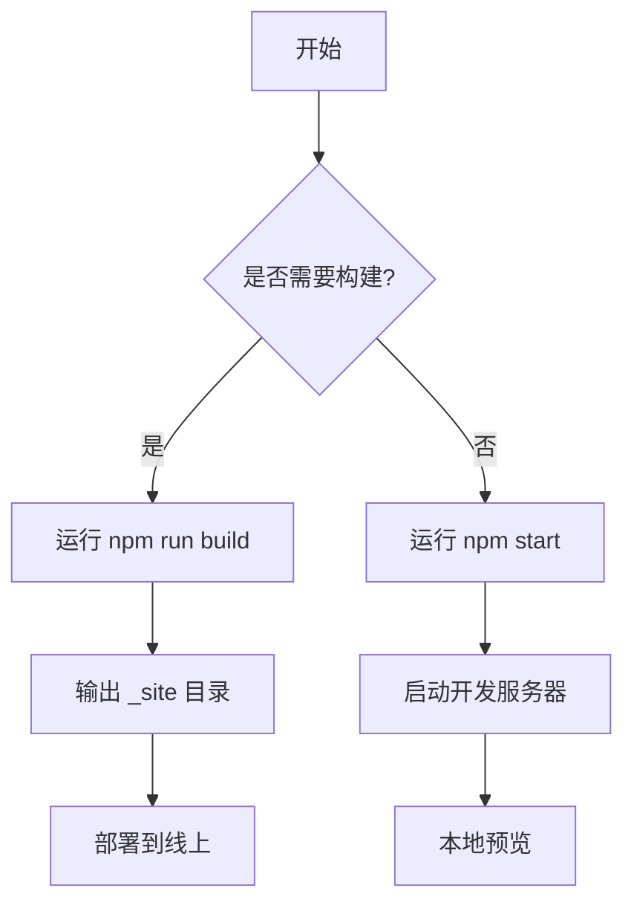
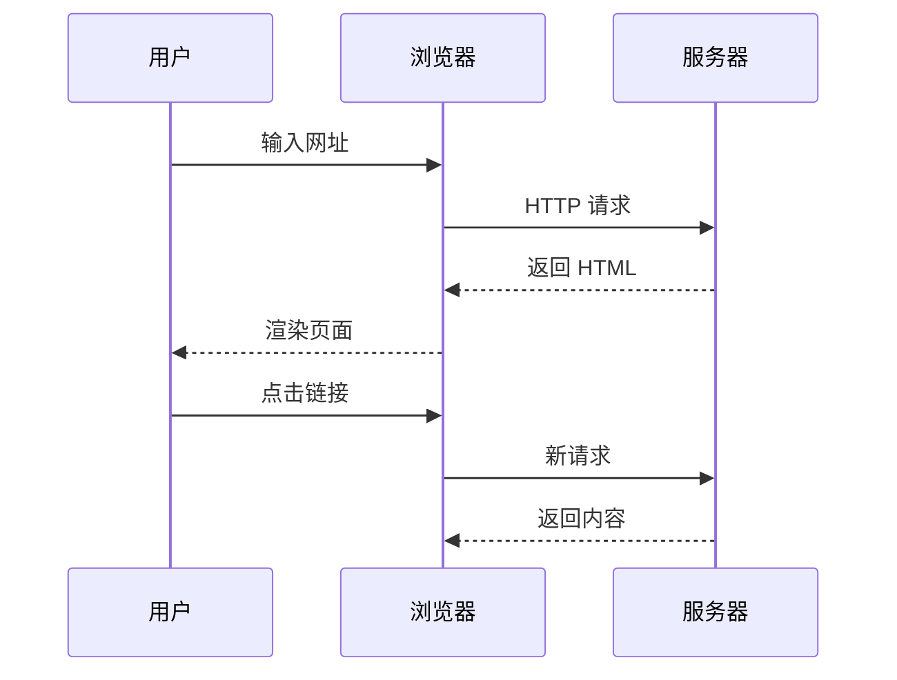
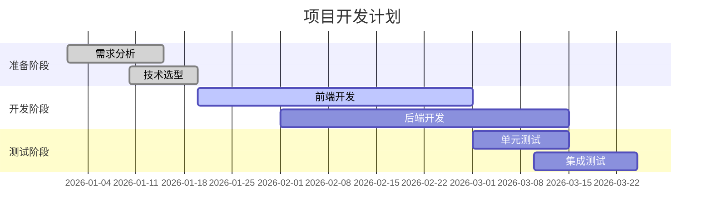
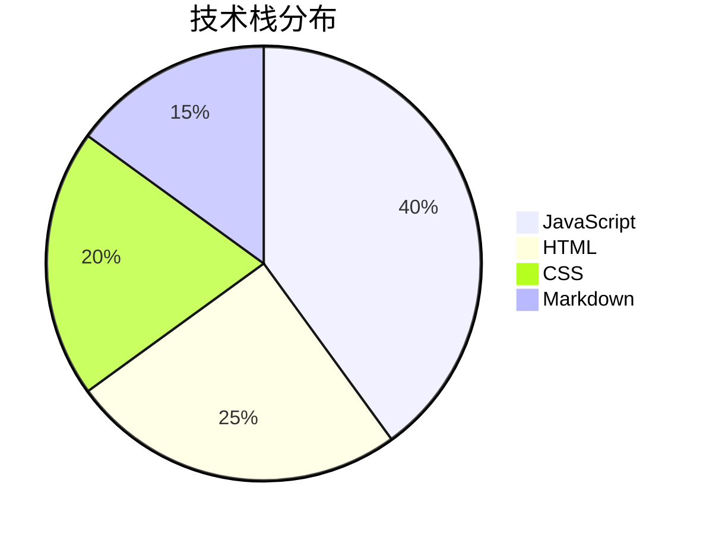

## 标题层级

Markdown 支持六级标题，用 `#` 数量区分：

### 三级标题

#### 四级标题

##### 五级标题

###### 六级标题

---

## 段落与换行

这是一个普通段落。Markdown 中段落之间用空行分隔。中文排版需要注意标点符号的使用，避免中英文之间缺少空格。

这是第二个段落。段落内的换行需要在行末加两个空格，或者使用 `<br>` 标签。

---

## 强调文本

- **粗体文本** — 使用 `**双星号**` 或 `__双下划线__`
- *斜体文本* — 使用 `*单星号*` 或 `_单下划线_`
- ***粗斜体*** — 使用 `***三星号***`
- ~~删除线~~ — 使用 `~~双波浪号~~`
- `行内代码` — 使用 `` `反引号` ``

---

## 链接

- 行内链接：[Eleventy 官网](https://www.11ty.dev/)
- 带标题的链接：[MDN Web Docs](https://developer.mozilla.org/ "Mozilla 开发者文档")
- 自动链接：<https://github.com/FXnadu/djy-11ty>

---

## 图片

图片语法与链接类似，前面加 `!`：

```markdown

```

### 实际示例


这是一张风景图片，展示了文章中图片的显示效果。图片会自适应容器宽度，保持响应式布局。

### 超长全景图


这是一张超宽的全景图片（3200×800），展示了文章中长图的显示效果。

---

## 无序列表

- 第一项
- 第二项
  - 嵌套项 A
  - 嵌套项 B
    - 更深层嵌套
- 第三项

使用星号：

* 星号列表项
* 另一项

使用加号：

+ 加号列表项
+ 另一项

---

## 有序列表

1. 第一步：安装依赖
2. 第二步：配置项目
3. 第三步：启动开发服务器
   1. 运行 `npm start`
   2. 打开浏览器访问 localhost

---

## 任务列表

- [x] 初始化 11ty 项目
- [x] 配置模板引擎
- [ ] 编写更多文章
- [ ] 部署到线上

---

## 引用

> 这是一段引用文本。引用可以包含多个段落。
>
> 第二段引用内容。

嵌套引用：

> 外层引用
>
> > 内层引用
> >
> > > 更深层引用

---

## 代码

### 行内代码

使用 `npm install` 安装依赖，然后运行 `npm start` 启动开发服务器。

### 代码块

JavaScript 示例：

```javascript
// eleventy.config.js
module.exports = async function(eleventyConfig) {
  eleventyConfig.addPlugin(syntaxHighlight);

  return {
    dir: {
      input: "src",
      output: "_site",
      includes: "_includes",
      data: "_data"
    }
  };
};
```

HTML 示例：

```html
<!DOCTYPE html>
<html lang="zh-CN">
<head>
  <meta charset="UTF-8">
  <title>DJY</title>
</head>
<body>
  <h1>Hello World</h1>
</body>
</html>
```

CSS 示例：

```css
:root {
  --paper: #f5f5f0;
  --ink: #0a0a0a;
}

body {
  font-family: "Inter", sans-serif;
  font-weight: 300;
  color: var(--ink);
  background: var(--paper);
}
```

Bash 命令：

```bash
npx @11ty/eleventy --serve --port 8080
```

JSON 配置：

```json
{
  "name": "djy-11ty",
  "version": "1.0.0",
  "scripts": {
    "start": "npx @11ty/eleventy --serve",
    "build": "npx @11ty/eleventy"
  }
}
```

---

## 表格

| 框架 | 语言 | 特点 |
|------|------|------|
| Eleventy | JavaScript | 零客户端 JS，灵活模板 |
| Next.js | React | 全栈框架，SSR/SSG |
| Astro | 多语言 | 岛屿架构，默认零 JS |
| Hugo | Go | 构建速度极快 |

对齐方式：

| 左对齐 | 居中 | 右对齐 |
|:-------|:----:|-------:|
| 文本 | 文本 | 文本 |
| 较长的内容 | 居中显示 | 1024 |

---

## 分隔线

以下三种写法都可以创建分隔线：

---

***

___

---

## 转义字符

\*这不是斜体\*

\*\*这不是粗体\*\*

\# 这不是标题

\[这不是链接\](这不是URL)

---

## 脚注

这是一个带有脚注的句子[^1]。这是另一个脚注[^2]。

[^1]: 第一个脚注的内容。
[^2]: 第二个脚注可以包含更多文字，甚至多个段落。

---

## 高亮标记

使用 `==双等号==` 实现文本高亮：这是 ==高亮文本== 的效果。

---

## GitHub 风格提示框

> [!NOTE]
> 这是一个注意提示框，用于提供有用的信息。

> [!TIP]
> 这是一个提示提示框，用于提供有用的建议。

> [!IMPORTANT]
> 这是一个重要提示框，用于强调关键信息。

> [!WARNING]
> 这是一个警告提示框，用于提醒潜在问题。

> [!CAUTION]
> 这是一个危险提示框，用于警告高风险操作。

---

## 键盘按键

使用键盘按键语法标记快捷键：

- 保存：[[Ctrl]] + [[S]]
- 复制：[[Ctrl]] + [[C]]
- 粘贴：[[Ctrl]] + [[V]]
- 撤销：[[Ctrl]] + [[Z]]
- 全选：[[Ctrl]] + [[A]]
- 切换开发者工具：[[F12]]
- macOS 保存：[[Cmd]] + [[S]]

---

## 定义列表

术语
:   术语的定义说明。定义列表用于解释术语或创建问答格式。

Markdown
:   一种轻量级标记语言，由 John Gruber 于 2004 年创建。
:   设计目标是让人们能够使用易读易写的纯文本格式编写文档。

Eleventy
:   一个简单的静态站点生成器，支持多种模板语言。
:   不强制使用前端框架，输出纯静态 HTML。

缩进定义
:   第一条定义
:   第二条定义
:   第三条定义

---

## 缩略语

HTML 和 CSS 是构建网页的基础技术。

*[HTML]: 超文本标记语言 (HyperText Markup Language)
*[CSS]: 层叠样式表 (Cascading Style Sheets)

缩略语下方有虚线下划线，鼠标悬停可查看全称。

---

## 折叠内容

::: details 点击展开查看详细内容
这是一段被折叠的内容。适合放置长代码、补充说明或不常用的信息。

- 支持列表
- 支持代码块
- 支持所有 Markdown 语法
:::

::: details 常见问题解答
**Q: 这个站点用什么技术栈？**

A: 基于 Eleventy (11ty) v3 + Nunjucks + Markdown 构建。

**Q: 如何本地运行？**

A: 执行 `npm install` 然后 `npm start` 即可。
:::

---

## Mermaid 流程图



---

## Mermaid 时序图



---

## Mermaid 甘特图



---

## Mermaid 饼图



---

## Tab 栏切换

### 纯文本 Tab

::: tab 优点
- 构建速度快，输出纯静态 HTML
- 零客户端 JavaScript
- 模板语言灵活，支持 Nunjucks / Liquid / Markdown
:::

::: tab 缺点
- 生态不如 Next.js 丰富
- 不内置 SSR / ISR 能力
- 插件质量参差不齐
:::

::: tab 适用场景
个人博客、文档站点、小型企业官网、作品集等对性能和简洁度有要求的项目。
:::

### 代码 Tab

::: tab JavaScript
```javascript
const greeting = "Hello, World!";
console.log(greeting);
```
:::

::: tab Python
```python
greeting = "Hello, World!"
print(greeting)
```
:::

::: tab Go
```go
package main
import "fmt"

func main() {
    fmt.Println("Hello, World!")
}
```
:::

---

## 总结

以上覆盖了 Markdown 的所有常见语法：标题、段落、强调、链接、图片、列表、任务列表、引用、代码、表格、分隔线、转义、脚注、高亮、GitHub 提示框、键盘按键、定义列表、缩略语、折叠内容和 Mermaid 图表。这些语法在基于 Eleventy + markdown-it 的站点中均能正确渲染。
