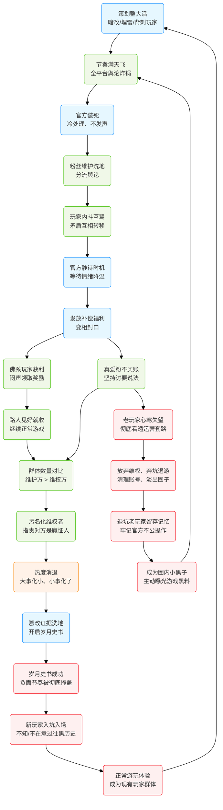

我亲身体验过不知道多少款网游后，得出一个结论：所有网游都不值得付出任何的感情，网游尤其是手游就是玩具。但架不住永远有人年轻，为连所有权都没有的虚拟的东西浪费自己感情。

那洛克王国上个月我才夸完它，言语之诚恳，结果第二个版本就直接跳了，我有预想过这种情况，但没想到这一天来的这么快。同时最令人咂舌的是，一个抓宠游戏也能扯上性别议题？

我都懒得看谁对谁错，遇到就直接屏蔽+减少推荐。不参与讨伐，同时直接删游戏就完事，==只要把搞对立打拳的东西从生活中剔除就世界就会变得美好== ，我已经对这种事情感到厌倦。这次只是无数网络舆论中普普通通的一个，以前有过，现在发生，以后也会重演。无非事情的走向又重复一遍下面的 mermaid 描绘的这样：

